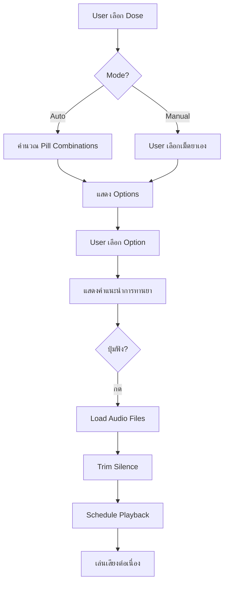

# SWLC React - ระบบสร้างฉลากยาวาร์ฟาริน

ระบบช่วยคำนวณและสร้างฉลากยาวาร์ฟาริน (Warfarin) สำหรับผู้ป่วย พร้อมระบบอ่านออกเสียงวิธีทานยาแบบ Offline

## 🚀 Tech Stack

| เทคโนโลยี | เวอร์ชัน | หน้าที่ |
|-----------|---------|---------|
| React | 19.x | UI Framework |
| Vite | 7.x | Build Tool |
| Tailwind CSS | 4.x | Styling |
| Web Audio API | - | Offline Audio Player |
| QRCode.react | 4.x | สร้าง QR Code |
| SweetAlert2 | 11.x | Alert/Modal |

## 📁 โครงสร้างโปรเจกต์

```
swlc-react/
├── public/
│   └── audio/                    # ไฟล์เสียงสำหรับอ่านฉลาก
│       ├── amounts/              # เสียงจำนวนเม็ด
│       ├── days/                 # เสียงวันในสัปดาห์
│       ├── frequency/            # เสียงความถี่
│       ├── phrases/              # เสียงคำศัพท์ทั่วไป
│       ├── pills/                # เสียงขนาดยา+สี
│       └── audio_phrases.json    # รายการไฟล์เสียงทั้งหมด
├── src/
│   ├── components/               # React Components
│   │   ├── App.jsx               # Main App
│   │   ├── AutoMode.jsx          # โหมดอัตโนมัติ (ใส่ dose)
│   │   ├── ManualMode.jsx        # โหมด Manual (เลือกเม็ดยาเอง)
│   │   ├── MedicationInstructions.jsx  # แสดงวิธีทานยา + ปุ่มฟัง
│   │   ├── DateCalculator.jsx    # คำนวณวันที่
│   │   ├── DayCard.jsx           # Card แสดงยาแต่ละวัน
│   │   ├── OptionCard.jsx        # Card แสดง Option
│   │   ├── Pill.jsx              # Visual เม็ดยา
│   │   ├── PillModal.jsx         # Modal เลือกเม็ดยา
│   │   └── Sidebar.jsx           # Sidebar เลือกขนาดยา
│   ├── utils/                    # Utility Functions
│   │   ├── constants.js          # ค่าคงที่ (สี, ชื่อ)
│   │   ├── offlineAudio.js       # ⭐ Offline Audio Player
│   │   ├── pillCalculator.js     # คำนวณ combination ยา
│   │   └── speechUtils.js        # สร้าง URL สำหรับ TTS
│   ├── index.css                 # Global Styles
│   └── main.jsx                  # Entry Point
└── package.json
```

---

## 🎵 ระบบ Offline Audio Player

### หลักการทำงาน

ใช้ **Web Audio API** เพื่อเล่นไฟล์เสียงต่อเนื่องแบบไม่มี gap:

1. **Preload** - โหลดไฟล์เสียงทั้งหมดเป็น AudioBuffer
2. **Trim Silence** - ตัด silence ออกจากต้น/ท้ายไฟล์อัตโนมัติ
3. **Schedule** - จัดคิวเสียงด้วย `source.start(time)` เพื่อ timing แม่นยำ
4. **Overlap** - ปรับได้ว่าเสียงจะทับกันหรือห่างกันเท่าไหร่

### ไฟล์หลัก: `src/utils/offlineAudio.js`

```javascript
// ค่าปรับแต่ง timing
const PAUSE_DELAY_MS = 0;        // ช่วงหยุดระหว่าง group (ms)
const OVERLAP_SECONDS = -0.01;   // ค่าลบ = มี gap, ค่าบวก = overlap

// Functions หลัก
playMedicationAudio(schedule, setButtonState)  // เล่นเสียง
stopAudio()                                     // หยุดเสียง
generateAudioSequence(schedule)                 // สร้าง sequence
```

### ลำดับการอ่าน

```
"ยาขนาด" → "2 มิลลิกรัม สีส้ม" → "กิน" → "1 เม็ด" → 
"สัปดาห์ละ 2 ครั้ง" → "เฉพาะ" → "วันจันทร์ วันพุธ"
```

### โครงสร้างไฟล์เสียง

ดู `public/audio/audio_phrases.json` สำหรับรายการไฟล์ทั้งหมด:

| กลุ่ม | ตัวอย่างไฟล์ | ข้อความ |
|-------|-------------|---------|
| medicine | `phrases/medicine.mp3` | "ยาขนาด" |
| pill_mg_color | `pills/2mg_orange.mp3` | "สอง มิลลิกรัม สีส้ม" |
| take | `phrases/take.mp3` | "กิน" |
| amount | `amounts/one.mp3` | "หนึ่งเม็ด" |
| frequency | `frequency/weekly_2.mp3` | "สัปดาห์ละสองครั้ง" |
| only | `phrases/only.mp3` | "เฉพาะ" |
| days | `days/monday.mp3` | "วันจันทร์" |
| stop | `phrases/stop.mp3` | "หยุดยา" |

---

## 🎨 Styling

### Tailwind CSS 4.x

ใช้ Tailwind CSS ผ่าน Vite plugin:

```javascript
// vite.config.js
import tailwindcss from '@tailwindcss/vite'

export default {
  plugins: [react(), tailwindcss()]
}
```

### สียา (Pill Colors)

กำหนดใน `src/utils/constants.js`:

| mg | สี | CSS Class |
|----|-----|-----------|
| 1 | ขาว | `bg-gray-100` |
| 2 | ส้ม | `bg-orange-100` |
| 3 | ฟ้า | `bg-blue-100` |
| 4 | เหลือง | `bg-yellow-100` |
| 5 | ชมพู | `bg-pink-100` |

### Print Styles

ใช้ CSS Media Query สำหรับพิมพ์:

```css
@media print {
  .no-print { display: none; }
  .qr-code-container { display: block !important; }
}
```

---

## 🔧 การติดตั้งและรัน

```bash
# ติดตั้ง dependencies
npm install

# รัน development server
npm run dev

# Build สำหรับ production
npm run build

# Preview production build
npm run preview
```

---

## 📝 การเพิ่ม/แก้ไขไฟล์เสียง

1. **อัดเสียง** ตามข้อความใน `audio_phrases.json`
2. **บันทึกเป็น MP3** ใส่ในโฟลเดอร์ที่ตรงกัน
3. **ตัด silence** ให้สั้นที่สุด (หรือระบบจะ auto-trim)
4. **ทดสอบ** โดยกดปุ่ม "ฟังวิธีทานยา"

### Tips อัดเสียง

- ใช้ sample rate 44100 Hz หรือ 48000 Hz
- ตัด silence ต้น/ท้ายให้เหลือ ~50ms
- รักษา volume ให้สม่ำเสมอ
- ใช้ bit rate 128kbps ขึ้นไป

---

## 🌐 ภาษา

- **UI**: ภาษาไทย 100%
- **Variable/Function names**: ภาษาอังกฤษ
- **Comments**: ภาษาไทย (เฉพาะส่วนสำคัญ)

---

## 📦 Dependencies สำคัญ

```json
{
  "react": "^19.2.0",
  "qrcode.react": "^4.2.0",
  "sweetalert2": "^11.26.18",
  "tailwindcss": "^4.1.18",
  "vite": "^7.2.4"
}
```

---

## 🔄 Flow การทำงาน



---

## 🐛 การแก้ไขปัญหา

### เสียงมี gap/ไม่ต่อเนื่อง

ปรับค่าใน `offlineAudio.js`:
```javascript
const OVERLAP_SECONDS = 0.05; // เพิ่มค่าให้มากขึ้น
```

### ไม่มีเสียง

1. ตรวจสอบว่ามีไฟล์เสียงใน `public/audio/`
2. ดู Console สำหรับ error message
3. ตรวจสอบ path ใน `offlineAudio.js`

### ปุ่มหยุดไม่ทำงาน

ตรวจสอบว่า `disabled` prop ใน button component ถูกต้อง:
```jsx
disabled={speechState === 'loading'} // ไม่ใช่ !== 'idle'
```

---

## 📄 License

MIT License
